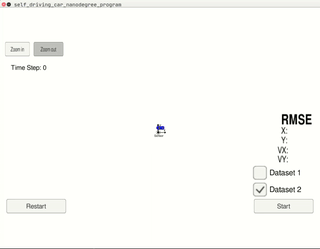
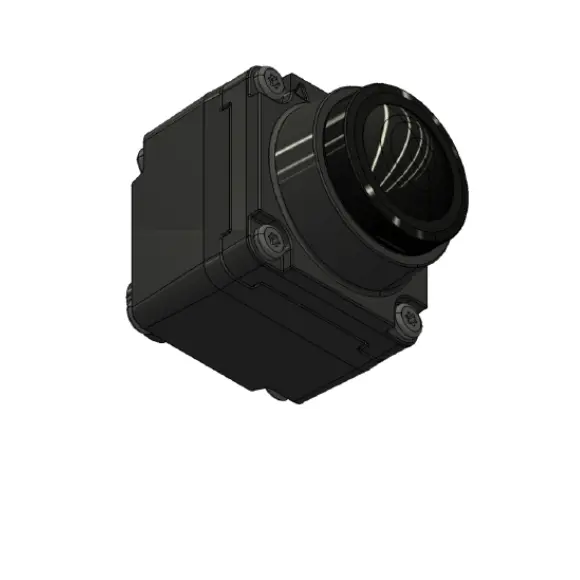

Project: Extended Kalman Filter
---

### Introduction
The major objective of this project is to implement a Kalman filter using *C++* as primay tool and tests with the [`Udacity simulator`](https://github.com/udacity/self-driving-car-sim). I'll be discussing following details to undestand few theoritical concepts that are used to implement this project.

* Sensors
* Kalman filter
* Extended Kalman filter
* Sensor fusion

|  |  |
|-------------------------------|-------------------------------|
|[*Dataset 01*](https://youtu.be/me-b7wNDdX4)| [*Dataset 02*](https://youtu.be/UQJ7q2JMteM)|

#### Sensors

*The three primary autonomous vehicle sensors are camera, radar and lidar. Working together, they provide the car visuals of its surroundings and help it detect the speed and distance of nearby objects, as well as their three-dimensional shape.  
In addition, sensors known as inertial measurement units help track a vehicle’s acceleration and location.* [Ref](https://blogs.nvidia.com/blog/2019/04/15/how-does-a-self-driving-car-see/)

##### Camera

*Autonomous vehicles rely on cameras placed on every side — front, rear, left and right — to stitch together a 360-degree view of their environment. Some have a wide field of view — as much as 120 degrees — and a shorter range. Others focus on a more narrow view to provide long-range visuals.* [Ref](https://blogs.nvidia.com/blog/2019/04/15/how-does-a-self-driving-car-see/)

||
|---------------------------------|
|Source: [An autonomous driving camera sensor developed by NVIDIA DRIVE partner Sekonix](https://blogs.nvidia.com/blog/2019/04/15/how-does-a-self-driving-car-see/)|
